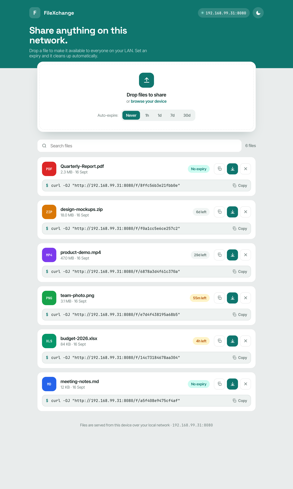
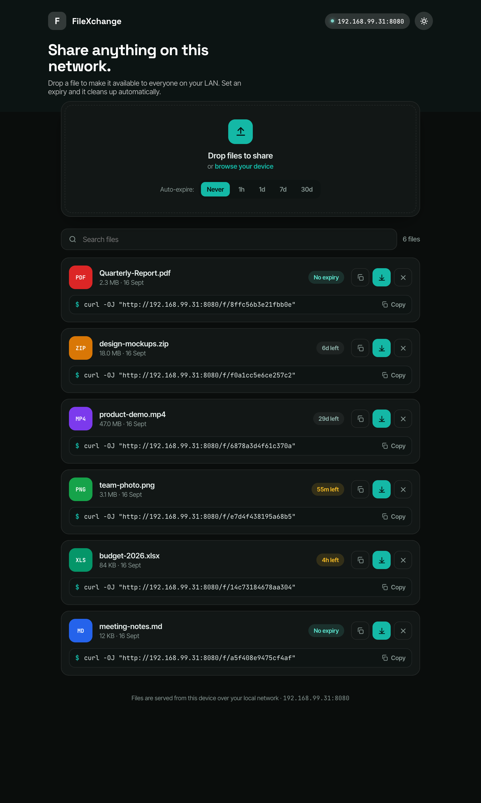
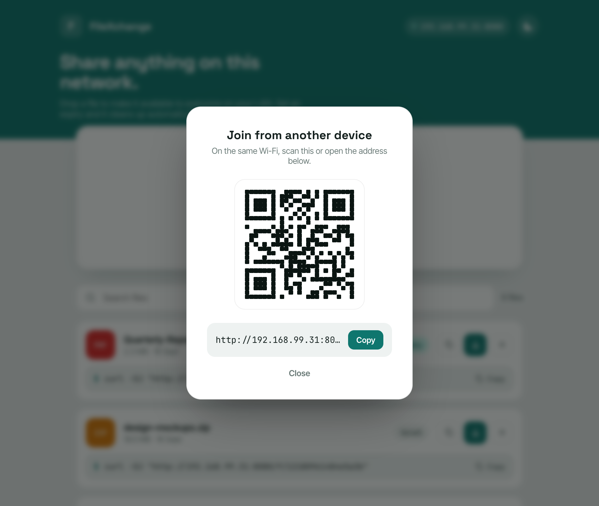
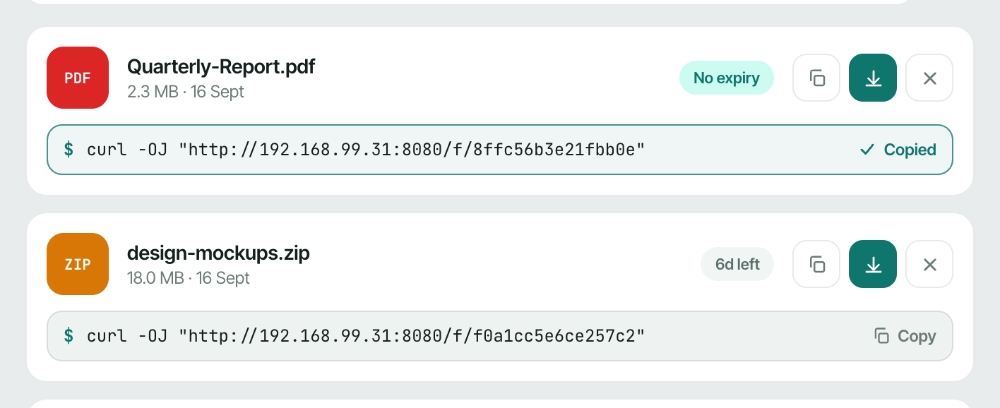

# FileXchange

Share files with everyone on your local network. Drop a file, pick an auto-expiry, and anyone on the same Wi-Fi can grab it — from their **browser** or a **one-line `curl` command** — with no accounts, no cloud, and no npm dependencies.



## Features

- **Drag-and-drop or browse** to upload, multiple files at once
- **Download in the browser** or **copy a ready-to-run `curl` command** shown under every file — paste it into any terminal on the LAN
- **Auto-expire**: Never / 1h / 1d / 7d / 30d — expired files are deleted from disk automatically
- **Search**, file-type badges, and live expiry countdown pills
- **Copy a shareable download link** for any file
- **Join via QR code** — other devices scan and connect instantly
- **Light / dark theme**, persisted per device

| Dark theme | Join from another device |
|---|---|
|  |  |

## Download from the terminal

Every file shows a **`curl` command** right underneath it. Click to copy, paste it into any terminal on the same network, and the file downloads under its original name — no browser required.



```sh
curl -OJ "http://192.168.1.42:8080/f/8ffc56b3e21fbb0e"
```

- **`-O`** writes the response to a local file; **`-J`** uses the name the server sends via `Content-Disposition`, so the download keeps its real filename instead of the random share ID.
- The host in the command matches whatever address you opened FileXchange from (shown in the app header and printed on startup), so a copied command works as-is from any other device on the LAN.
- Works anywhere `curl` does — macOS, Linux, WSL, Git Bash, and Windows 10+ (which ships `curl`). On Windows **PowerShell**, run it as `curl.exe -OJ "..."`, because plain `curl` there is an alias for a different command.

Perfect for headless servers, Raspberry Pis, CI boxes, or any time it's quicker to paste a line than open a browser. It's the same `/f/<id>` endpoint the browser download and copy-link buttons use — `curl -OJ` just adds the auto-naming.

## Quick start

Requires **Node.js 18+**. No `npm install` needed.

```sh
git clone https://github.com/sm-coding-projects/FileXchange.git
cd FileXchange
node server.js
```

```
FileXchange running:
  Local:   http://localhost:8080
  Network: http://192.168.1.42:8080
```

Open the **Network** URL from any device on the same network, or click the host pill in the header for a QR code to scan.

## Deploying on Linux

### 1. Install Node.js 18+

**Debian / Ubuntu**

```sh
sudo apt-get update
sudo apt-get install -y nodejs
node --version   # needs >= 18; if too old, use NodeSource:
# curl -fsSL https://deb.nodesource.com/setup_22.x | sudo -E bash -
# sudo apt-get install -y nodejs
```

**Fedora / RHEL / CentOS Stream**

```sh
sudo dnf install -y nodejs
```

### 2. Get the code

```sh
sudo mkdir -p /opt/filexchange
sudo git clone https://github.com/sm-coding-projects/FileXchange.git /opt/filexchange
```

Test it:

```sh
cd /opt/filexchange
node server.js          # Ctrl+C to stop
# or on a different port:
PORT=3000 node server.js
```

### 3. Run as a systemd service

Create a dedicated user and give it ownership (uploads and metadata are written next to `server.js`):

```sh
sudo useradd --system --home /opt/filexchange --shell /usr/sbin/nologin filexchange
sudo chown -R filexchange:filexchange /opt/filexchange
```

Create `/etc/systemd/system/filexchange.service`:

```ini
[Unit]
Description=FileXchange LAN file sharing
After=network-online.target
Wants=network-online.target

[Service]
Type=simple
User=filexchange
Group=filexchange
WorkingDirectory=/opt/filexchange
ExecStart=/usr/bin/node /opt/filexchange/server.js
Environment=PORT=8080
Restart=on-failure
RestartSec=3

# Hardening
NoNewPrivileges=true
ProtectSystem=strict
ProtectHome=true
ReadWritePaths=/opt/filexchange
PrivateTmp=true

[Install]
WantedBy=multi-user.target
```

Enable and start:

```sh
sudo systemctl daemon-reload
sudo systemctl enable --now filexchange
systemctl status filexchange        # check it's running
journalctl -u filexchange -f        # follow logs
```

### 4. Open the firewall

**Ubuntu / Debian (ufw)**

```sh
sudo ufw allow 8080/tcp
```

**Fedora / RHEL (firewalld)**

```sh
sudo firewall-cmd --permanent --add-port=8080/tcp
sudo firewall-cmd --reload
```

### 5. Use it

From any device on the LAN, open `http://<server-ip>:8080` (the server prints its detected address on startup, and the host pill in the app header shows it too). Or copy a file's `curl` command and run it from a terminal.

## Configuration & data

| What | Where |
|---|---|
| Port | `PORT` environment variable (default `8080`) |
| Uploaded files | `uploads/` (one file per share, named by ID) |
| Metadata | `files.json` (survives restarts) |
| Expiry sweep | every 30 seconds |
| Max upload size | 4 GB |

To back up shared files, copy `uploads/` together with `files.json`.

## Security notes

FileXchange is designed for **trusted local networks**. There is no authentication: anyone who can reach the port can upload, download, and delete files. Keep it behind your LAN/firewall and don't port-forward it to the internet. Download links (and the `curl` commands, which hit the same `/f/<id>` endpoint) use unguessable random IDs, and the server blocks path traversal, but that is not a substitute for network-level isolation.

## Tech

- Zero-dependency Node.js server (`server.js`) — static hosting, streaming uploads/downloads, expiry sweep
- Vanilla HTML/CSS/JS frontend (`public/index.html`) — file list, copy-link and copy-`curl` actions rendered per file
- QR rendering by a vendored copy of [qrcode-generator](https://github.com/kazuhikoarase/qrcode-generator) (MIT) in `public/vendor/`

URL parameters: `?theme=dark|light` forces a theme, `?join=1` opens the QR overlay on load.
